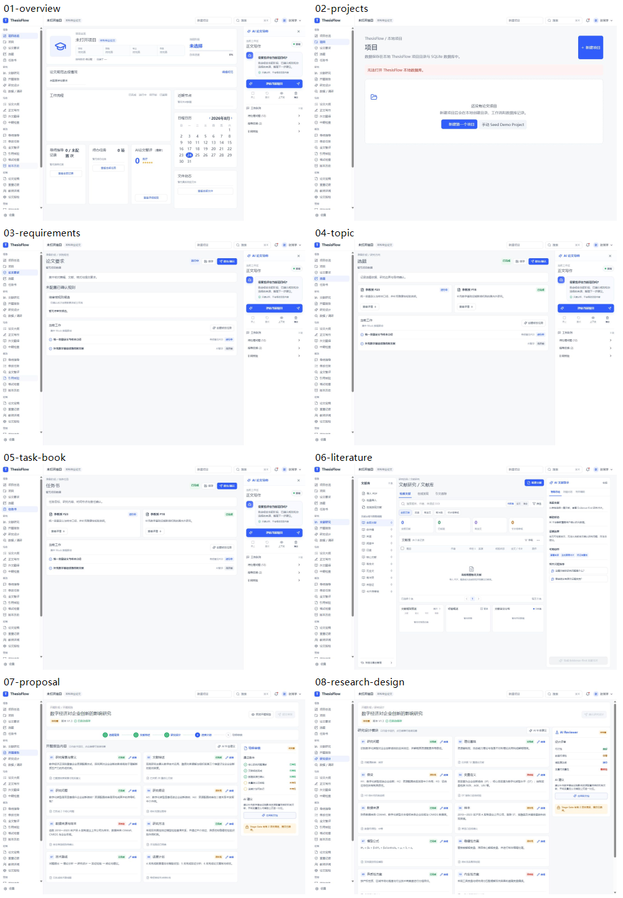
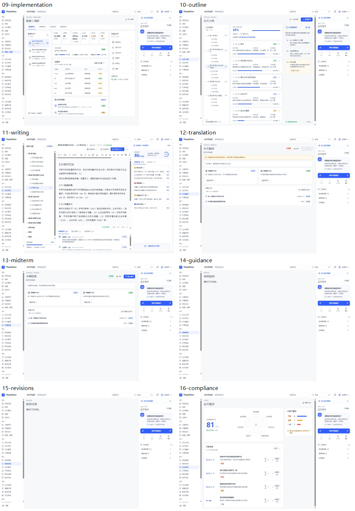
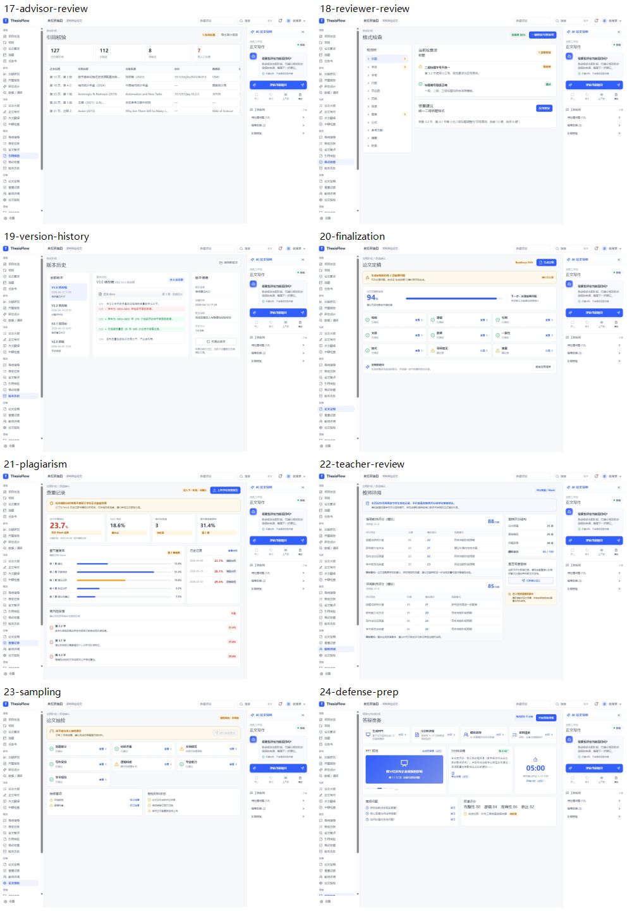
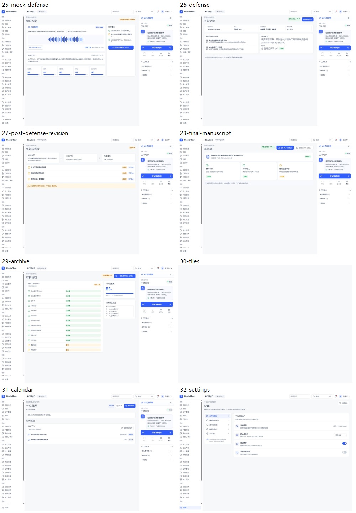

# ThesisFlow 全界面视觉与可用性审计

日期：2026-08-24
范围：桌面视口 1329 × 912，32 个实际路由，包含侧栏、顶栏、AI 面板及主要页面内容。
目标：检查视觉层级、文字排布、字号、密度、空状态、共享组件一致性与可见的无障碍风险。

## 总体结论

整体视觉语言统一，蓝白色体系、卡片边界和路由分组已经形成稳定产品感。主要问题不是“风格混乱”，而是三类系统性问题：

1. 文字和操作尺寸偏小。大量标签、表格信息与辅助文字低于 12px；侧栏和多数次级按钮高度不足 32px。
2. 页面完成度不均衡。研究、写作、答辩页面内容较完整，而导师指导、修改任务以及无项目文件中心只有一句提示和大面积空白。
3. 共享上下文不完整。审计前，个人菜单信息过少，AI 面板工作区名称固定为“正文写作”，不能反映当前页面。

## 已在本轮修复

- 个人菜单增加学号、学校/学院、专业/年级、指导教师、当前阶段及项目资料/设置入口。
- AI 面板当前工作区改为基于路由实时更新，已验证“导师指导”和“任务书”。
- 文件中心增加非 Tauri 环境保护，避免浏览器预览整页崩溃。

## 最高优先级问题

### P1：全局字号与点击目标偏小

- 侧栏条目高度约 27px，顶栏和大量页面按钮约 30px；桌面鼠标可用，但高缩放、触控板及行动不便用户操作困难。
- 多数界面大量使用 9–11px 辅助文字，密集页面中阅读负担明显。
- 建议建立三档文字下限：正文 13px、辅助 11–12px、仅徽标可使用 10px；常用操作高度提升到 32–36px。

### P1：空状态缺少任务引导

- `/guidance` 与 `/revisions` 只有“请先打开项目”，画面大面积空白。
- `/files` 修复崩溃后仍是横向散开的文字提示，没有集中容器和明确按钮。
- 建议统一空状态：图标、标题、原因、主按钮“前往项目”、次级帮助文案，最大宽度控制在 420–520px。

### P1：高密度页面的信息层级不足

- `/outline`、`/literature`、`/writing` 同时呈现多栏、表格、状态、按钮和 AI 信息，视觉优先级接近。
- `/outline` 检测到 8 处文字裁切和 10 个没有可见文本/ARIA 名称的按钮；`/literature` 有 2 个，`/writing` 有 1 个。
- 建议先收紧次级面板、扩大主工作区、为图标按钮补齐名称，并减少同屏强调色数量。

### P2：内容密度跨页面跳变

- 开题报告、研究设计、正文写作非常密集；导师指导和修改任务极度稀疏。
- 用户切换页面时会感到产品成熟度不一致。
- 建议统一页面骨架：页头、状态摘要、主任务区、辅助区、空状态/内容状态。

### P2：低对比度辅助文字过多

- `#98a2b3` 被大量用于 9–11px 文本，在白色背景上容易显得发灰。
- 建议将需要阅读的辅助说明提升到更深的灰色；浅灰只用于时间戳、非关键占位符和禁用态。

## 路由检查清单

| # | 路由 | 页面 | 健康度 | 主要观察 |
|---:|---|---|---|---|
| 1 | `/overview` | 项目总览 | 良好 | 层级清楚；辅助文字与操作仍偏小。 |
| 2 | `/projects` | 项目 | 一般 | 空状态有入口，但错误提示与操作区略分散。 |
| 3 | `/requirements` | 论文要求 | 一般 | 结构稳定；小字号占比高。 |
| 4 | `/topic` | 选题 | 一般 | 卡片一致；正文与徽标尺寸偏小。 |
| 5 | `/task-book` | 任务书 | 一般 | 与选题高度复用，辨识度不足。 |
| 6 | `/literature` | 文献研究 | 需优化 | 三栏密度高，文字偏小，存在未命名图标按钮。 |
| 7 | `/proposal` | 开题报告 | 一般 | 内容完整；同屏状态与按钮较多。 |
| 8 | `/research-design` | 研究设计 | 一般 | 信息丰富但页面较长，卡片密度高。 |
| 9 | `/implementation` | 数据 / 调研 | 需优化 | 复杂三栏布局，发现 3 处裁切。 |
| 10 | `/outline` | 论文大纲 | 需优先优化 | 裁切和未命名按钮最多，主任务焦点被多栏稀释。 |
| 11 | `/writing` | 正文写作 | 需优化 | 编辑器主体明确，但两侧信息挤压正文。 |
| 12 | `/translation` | 外文翻译 | 一般 | 结构清楚，尺寸偏小且与任务书模板相似。 |
| 13 | `/midterm` | 中期检查 | 一般 | 可扫读，但信息量少时留白过大。 |
| 14 | `/guidance` | 导师指导 | 较差 | 只有一句空状态，缺少下一步操作。 |
| 15 | `/revisions` | 修改任务 | 较差 | 只有一句空状态，缺少任务引导。 |
| 16 | `/compliance` | 全文智评 | 良好 | 核心分数突出；列表操作仍偏小。 |
| 17 | `/advisor-review` | 引用核验 | 一般 | 表格清楚，发现 1 处文字裁切。 |
| 18 | `/reviewer-review` | 格式检查 | 良好 | 左侧分类与主结果关系明确。 |
| 19 | `/version-history` | 版本历史 | 良好 | 三栏逻辑清楚，辅助文字偏小。 |
| 20 | `/finalization` | 论文定稿 | 良好 | 进度和状态明确，发现 1 处裁切。 |
| 21 | `/plagiarism` | 查重记录 | 良好 | 指标层级明确；数据文字过密。 |
| 22 | `/teacher-review` | 教师评阅 | 一般 | 表格信息完整，但小字号数量突出。 |
| 23 | `/sampling` | 论文抽检 | 一般 | 状态清楚，卡片内容略显压缩。 |
| 24 | `/defense-prep` | 答辩准备 | 良好 | 核心任务可见；按钮尺寸偏小。 |
| 25 | `/mock-defense` | 模拟答辩 | 良好 | 录音视觉明确；次级信息层级偏弱。 |
| 26 | `/defense` | 答辩记录 | 良好 | 信息结构稳定，操作目标偏小。 |
| 27 | `/post-defense-revision` | 答辩后修改 | 一般 | 任务列表可读，空白区域略多。 |
| 28 | `/final-manuscript` | 最终稿 | 良好 | 状态卡片清楚，次要文字偏小。 |
| 29 | `/archive` | 材料归档 | 一般 | 清单完整，但浅色小字过多。 |
| 30 | `/files` | 文件中心 | 已修复 / 待优化 | 浏览器崩溃已修复；无项目空状态仍需重新排版。 |
| 31 | `/calendar` | 节点日历 | 一般 | 复用基础模板，缺少真正日历视觉。 |
| 32 | `/settings` | 设置 | 一般 | 分区清楚；有 2 个未命名按钮，控制尺寸偏小。 |

## 无障碍风险与证据限制

- 截图与 DOM 测量能确认尺寸、裁切、可见文字和明显的按钮命名问题，但不能证明完整 WCAG 合规。
- 尚未完成全路由键盘顺序、焦点陷阱、读屏名称、缩放 200%、高对比模式和动态状态播报测试。
- 固定 `min-width: 1280px` 会限制窄屏与高缩放重排能力，属于需要专项验证的风险。

## 证据

修复后证据：`fix-profile.png`、`fix-guidance.png`、`fix-task-book.png`、`fix-files.png`。
